# System Diagrams

## 1. Architecture

- **Client** -> **Server** (Auth + Application)
- **Server** connects to:
  - **PostgreSQL** (Primary DB)
  - **Redis** (Cache/Session)

## 2. ER Diagram

## Sequence Diagrams

### 1. Fraud Detection Sequence

### 2 Order Sequence

### 3 Payment Sequence

### 4 Authentication Sequence

```mermaid
sequenceDiagram
    autonumber

    participant Client as 🖥️ Client
    participant Server as 🟦 Server
    participant TokenService as 🔑 TokenService
    participant Database as 🗄️ Database

    title Authentication Sequence

    Client->>Server: Login request
    activate Server
    Server->>Server: Validate body

    Server->>Database: Retrieve user info
    Database-->>Server: User data

    Server->>Server: Validate credentials

    alt if credentials do not match
        Server-->>Client: Return errors
    else credentials valid
        Server->>TokenService: Generate tokens
        TokenService-->>Server: Access & Refresh tokens
        Server-->>Client: Return tokens
    end

    deactivate Server
```

### 5 Authorization Sequence

```mermaid
sequenceDiagram
    autonumber

    participant Client as 🖥️ Client
    participant Server as 🟦 Server
    participant TokenService as 🔑 Token Service

    title Authorization Sequence

    Client->>Server: Locked Request
    activate Server

    Server->>TokenService: Validate Auth token
    TokenService-->>Server: Token status (Valid/Invalid)

    alt if token is invalid
        Server-->>Client: Return 401 Unauthorized
    else token is valid
        Server->>Server: Validate Role & Permissions

        alt if role and permission don't exist
            Server-->>Client: Return 403 Forbidden
        else authorized
            Server-->>Client: Forward to routes / Success
        end
    end

    deactivate Server
```

