# Mini E-Commerce API

A robust backend for a mini e-commerce application built with NestJS, designed to handle products, carts, orders, and payments with fraud detection capabilities.

## 🛠 Tech Stack

- **Framework:** [NestJS](https://nestjs.com/) (Node.js)
- **Language:** TypeScript
- **Database:** PostgreSQL
- **ORM:** TypeORM
- **Caching & Sessions:** Redis
- **Containerization:** Docker & Docker Compose
- **Payment Gateways:** SSLCommerz, Stripe
- **Authentication:** Passport (JWT strategy)
- **Documentation:** Swagger / OpenAPI

## 🚀 Setup Instructions

### Prerequisites

- [Docker](https://www.docker.com/) and Docker Compose installed on your machine.
- [Node.js](https://nodejs.org/) and [pnpm](https://pnpm.io/) (if running locally without Docker).

### Option 1: Run with Docker (Recommended)

This project is fully containerized. You can spin up the API, Database, and Redis with a single command.

1.  **Clone the repository:**

    ```bash
    git clone <repository-url>
    cd mini-e-commerce
    ```

2.  **Create `.env` file:**
    Copy the example environment file (or create one based on `docker-compose.yml` variables).

    ```bash
    cp .env.example .env
    ```

3.  **Start the application:**

    ```bash
    docker-compose up --build
    ```

    - The API will be available at `http://localhost:3000`.
    - Swagger documentation: `http://localhost:3000/api` (or `/doc` depending on config).

### Option 2: Run Locally

1.  **Install dependencies:**

    ```bash
    pnpm install
    ```

2.  **Start Infrastructure:**
    Ensure you have PostgreSQL and Redis running locally or via Docker.

    ```bash
    # You can use the docker-compose to start just the services if you like
    docker-compose up postgres redis -d
    ```

3.  **Configure Environment:**
    Update your `.env` file to point to your local database and Redis instances.

4.  **Run Migrations (if applicable):**

    ```bash
    pnpm run migration:run
    ```

5.  **Start the server:**
    ```bash
    pnpm run start:dev
    ```

## 🗄️ Database Migrations

Migrations are automatically executed when the application starts in the **Development** Docker environment.

- **Development:** The `migration:run` script is executed before `start:dev`.
- **Production:** Database migrations should be run manually or as part of a deployment pipeline, as the production container does not include development tools required to run TypeScript migrations directly.

### Managing Migrations Manually

To run migrations manually (e.g., when running locally without Docker):

```bash
# Run pending migrations
pnpm run migration:run

# Revert last migration
pnpm run migration:revert

# Generate a new migration
pnpm run migration:generate <MigrationName>
```

## 📊 Database Schema / ER Diagram

The database uses a relational model with UUIDs for primary keys to ensure scalability.


## 🔄 Sequence Diagrams

### 1. Fraud Detection Sequence


### 2. Order Sequence


### 3. Payment Sequence


### 4. Authentication Sequence

```mermaid
sequenceDiagram
    autonumber

    participant Client as 🖥️ Client
    participant Server as 🟦 Server
    participant TokenService as 🔑 TokenService
    participant Database as 🗄️ Database

    title Authentication Sequence

    Client->>Server: Login request
    activate Server
    Server->>Server: Validate body

    Server->>Database: Retrieve user info
    Database-->>Server: User data

    Server->>Server: Validate credentials

    alt if credentials do not match
        Server-->>Client: Return errors
    else credentials valid
        Server->>TokenService: Generate tokens
        TokenService-->>Server: Access & Refresh tokens
        Server-->>Client: Return tokens
    end

    deactivate Server
```



### 5. Authorization Sequence

```mermaid
sequenceDiagram
    autonumber

    participant Client as 🖥️ Client
    participant Server as 🟦 Server
    participant TokenService as 🔑 Token Service

    title Authorization Sequence

    Client->>Server: Locked Request
    activate Server

    Server->>TokenService: Validate Auth token
    TokenService-->>Server: Token status (Valid/Invalid)

    alt if token is invalid
        Server-->>Client: Return 401 Unauthorized
    else token is valid
        Server->>Server: Validate Role & Permissions

        alt if role and permission don't exist
            Server-->>Client: Return 403 Forbidden
        else authorized
            Server-->>Client: Forward to routes / Success
        end
    end

    deactivate Server
```



## 🏗 Key Architectural Decisions

1.  **Modular Architecture:** The application is structured into domain-specific modules (e.g., `UserModule`, `ProductModule`, `OrderModule`) to enforce separation of concerns and maintainability.
2.  **UUID Primary Keys:** UUIDs are used instead of auto-incrementing integers to prevent enumeration attacks and allow for distributed database scaling in the future.
3.  **Redis Caching:** Redis is utilized to handle caching and potentially session management/counters, particularly for the fraud detection mechanism (tracking cancellation rates).
4.  **Dockerized Development:** The entire environment is defined in `docker-compose.yml` to ensure consistency across different development machines and simplify setup.
5.  **TypeORM with PostgreSQL:** Provides a robust outcome for managing relational data with strong typing support, ensuring data integrity.

## 📝 Assumptions

The following assumptions were made during the development of this project:

1.  **Cart Operations:** When a user places an order, it is assumed they are ordering the **entire** contents of their current cart. Partial checkout of the cart is not currently supported.
2.  **Fraud Detection Rule:** To prevent abuse, the system assumes a simple fraud detection rule: A user can cancel up to **5 orders within a one-hour window**. Exceeding this limit will trigger a restriction (e.g., `order_restricted` status).
3.  **User Roles:** A user is assigned exactly **one role** at a time—either `customer` or `admin`. Complex multi-role setups are not part of the current scope.
4.  **Stock Reservation**: Stock is not reserved when adding items to the cart. Validation happens only at the moment of order creation
5.  **Payment**: Payment is not processed until the order is confirmed. The payment process is handled by a third-party payment gateway (e.g., Stripe, SSLcommerz).
